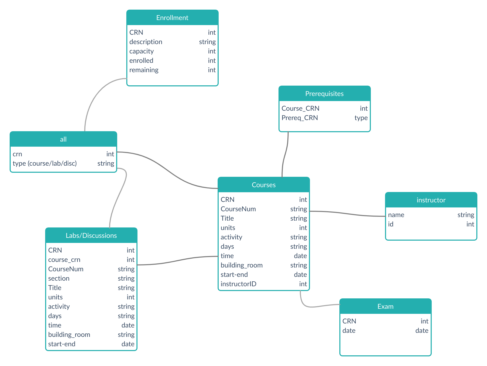

mercedtime
==========

Just your regular UC Merced course catalog, but not terrible.

See our [presentation](presentation/mercedtime.pdf).

If anyone is unfamiliar with berkeleytime.com, it is an online course discovery
platform that wraps all the relevant course information into a small, easy to
use package. Students at UC Berkeley are spoiled by this incredibly useful web
application so we want to build our own for the students here at UC Merced.

Use Cases
---------

* **More Pluggable** - Connect the data with other services such as
  _Rate My Professor_ and _Canvas_
* **Automated course tracking** - users will be able to track openings in and
  receive notifications for their courses
* **Ease of Use** - Having different filter options one click away increases
  course discoverability
* **Better Design** - Our default course schedule is not designed well.
    * This give us the opportunity to re-design the way we look for classes
      from the bottom up

Database Design
---------------

### UML & Relational Model
The majority of our database is centered around the CRN which is not an ID that
we have control of which may be an issue in the development phase by we will
cross that bridge when we get there.

### Pain Points
* Our database design relies on CRNs as the primary key which is not going to
  be in our control
* Splitting the Labs/Discussions from Lectures may have a performance cost
* Implementing notifications and Canvas integration may present unforeseen
  complications

TODO
----

* Notifications
* Integration with Canvas and RateMyProfessor
* Get average course grades
* Mobile App???

### Authors
* Noah McCullah
* Harrison Brown
